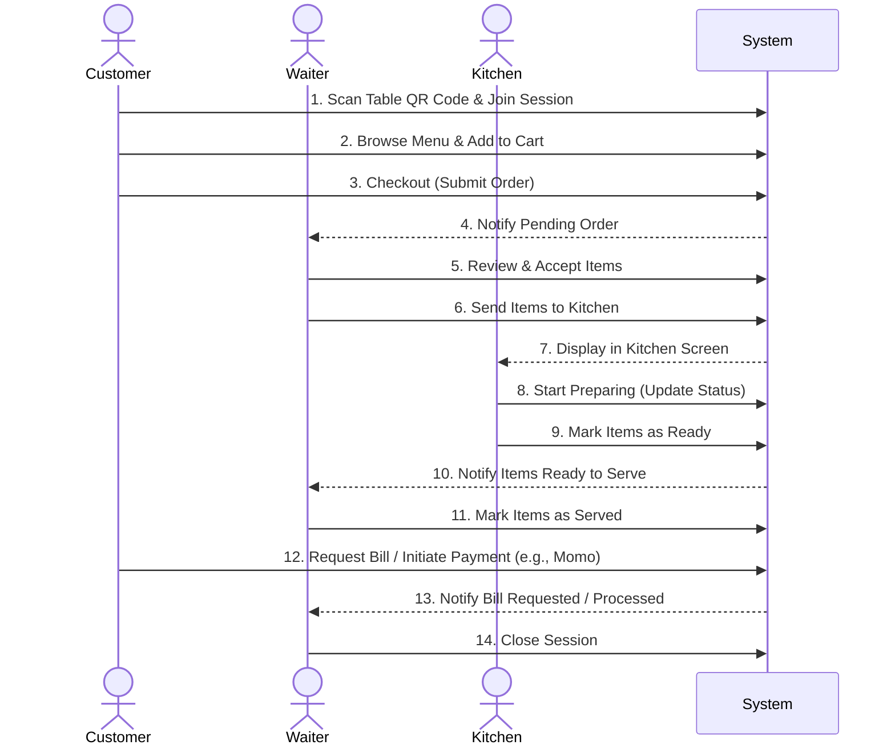

# Smart Restaurant Application

**Live Environments:**
- **Frontend (FE):** https://worldwide-restaurant.onrender.com
- **Backend (BE):** https://worldwide-restaurant-spring.onrender.com

---

## Table of Contents
- [1. Technical Stack](#1-technical-stack)
- [2. Vibe Coding & Development Rules](#2-vibe-coding--development-rules)
- [3. Core Workflow](#3-core-workflow)
- [4. Local Setup Guide](#4-local-setup-guide)
- [5. Backend Endpoints](#5-backend-endpoints)
  - [A. Authentication (Public)](#a-authentication-public)
  - [B. User & Staff Profiles (Authenticated/Admin)](#b-user--staff-profiles-authenticatedadmin)
  - [C. Sessions & Ordering (Customer)](#c-sessions--ordering-customer)
  - [D. Table & QR Management (Admin)](#d-table--qr-management-admin)
  - [E. Menu Management (Admin)](#e-menu-management-admin)
  - [F. Modifier Groups Management (Admin)](#f-modifier-groups-management-admin)
  - [G. Kitchen Operations (Kitchen Staff)](#g-kitchen-operations-kitchen-staff)
  - [H. Waiter Operations (Waiter)](#h-waiter-operations-waiter)
  - [I. Payments (Public/Admin)](#i-payments-publicadmin)

---

## 1. Technical Stack

### Backend
- **Core:** Java 21, Spring Boot 4.0.2
- **Database:** PostgreSQL with Spring Data JPA
- **Security & Auth:** Spring Security, JWT (jjwt 0.12.6)
- **Utilities:** Cloudinary (Image Hosting), ZXing (QR Code Generation), Apache PDFBox (PDF exports), Spring Boot Mail

### Frontend
- **Core:** React 19, Vite 7, JavaScript
- **Styling:** TailwindCSS 4
- **State & Routing:** React Router DOM 7
- **Networking & Assets:** Axios, Lucide React (Icons)

---

## 2. Vibe Coding & Development Rules

A significant portion of this project was built using AI "Vibe Coding", specifically generating the frontend architecture, components, and design based on conversational prompts and context.

For an in-depth view of the specific rules and prompts provided to the AI during development, please refer to the following custom documentation files:

- 📖 **[Frontend Vibe Coding Rules](./docs/rules-for-frontend-code.md)** 
- 📖 **[Backend Development Rules](./docs/rules-for-backend-code.md)**

---

## 3. Core Workflow

A high-level view of how Customers, Waiters, and Kitchen staff interact through the system.



---

## 4. Local Setup Guide

### Prerequisites
- JDK 17+
- Maven 3.8+
- Node.js 18+ and npm
- MySQL / PostgreSQL (based on application properties)

### Running the Backend

1. **Navigate to Backend Directory:**
   ```bash
   cd Source/RestaurantBackend
   ```
2. **Configure Environment variables:**
   Update `src/main/resources/application.properties` with your local Database credentials and Momo keys.
3. **Build and Run:**
   ```bash
   mvn clean install -DskipTests
   mvn spring-boot:run
   ```
   The application will start on `http://localhost:8080`.

### Running the Frontend

1. **Navigate to Frontend Directory:**
   ```bash
   cd Source/frontend
   ```
2. **Install Dependencies:**
   ```bash
   npm install
   ```
3. **Start the Development Server:**
   ```bash
   npm run dev
   ```
   The frontend will run on `http://localhost:5173`.

---

## 5. Backend Endpoints

### A. Authentication (Public)

| Method | Endpoint | Description |
|---|---|---|
| `POST` | `/api/auth/register` | **Register User**<br/>Req: `{"email": "...", "password": "...", "firstName": "..."}`|
| `POST` | `/api/auth/login` | **Login**<br/>Req: `{"email": "...", "password": "..."}`<br/>Res: `{ "token": "jwt", "role": "ADMIN" }`|
| `POST` | `/api/auth/verify-email` | **Verify Email**<br/>Req: `{"token": "..."}`|
| `POST` | `/api/auth/forgot-password`| **Request Password Reset**<br/>Req: `{"email": "..."}`|
| `POST` | `/api/auth/reset-password` | **Reset Password**<br/>Req: `{"token": "...", "newPassword": "..."}`|
| `PUT`  | `/api/auth/update-password`| **Update Password (Authenticated)**<br/>Req: `{"currentPassword": "...", "newPassword": "..."}`|

### B. User & Staff Profiles (Authenticated/Admin)

| Method | Endpoint | Description |
|---|---|---|
| `GET` | `/api/users/profile` | **Get Current Profile**<br/>Res: `{ "email": "...", "role": "WAITER" }`|
| `PUT` | `/api/users/profile` | **Update Profile**<br/>Req: `{"firstName": "...", "lastName": "..."}`|
| `POST`| `/api/users/avatar` | **Upload Avatar** (Multipart Data)|
| `POST`| `/api/users/staff` | **Create Staff Worker (Admin)**<br/>Req: `{"email": "...", "role": "WAITER"}`|
| `GET` | `/api/users/staff` | **List Staff (Admin)**<br/>Res: `[{"id": "...", "role": "KITCHEN_STAFF"}]`|
| `PUT` | `/api/users/staff/{id}/status` | **Update Staff Status (Admin)**<br/>Req: `{"status": "INACTIVE"}`|

### C. Sessions & Ordering (Customer)

| Method | Endpoint | Description |
|---|---|---|
| `POST` | `/api/sessions` | **Start Session via QR**<br/>Req: `{"token": "uuid", "guestCount": 2}`<br/>Res: `{ "sessionId": "uuid", "status": "ACTIVE" }`|
| `GET` | `/api/sessions/{id}` | **Get Session Details**<br/>Res: `{ "cartItems": [], "cartTotal": 0 }`|
| `POST` | `/api/sessions/{id}/cart/items` | **Add To Cart**<br/>Req: `{"menuItemId": "id", "quantity": 1}`<br/>Res: `Updated Session Object`|
| `PUT` | `/api/sessions/{id}/cart/items/{itemId}` | **Update Cart Item**<br/>Req: `{"quantity": 2, "specialInstructions": "No ice"}`|
| `POST` | `/api/sessions/{id}/checkout` | **Checkout Cart**<br/>Req: `{"specialInstructions": "Fast please"}`<br/>Res: `{ "orderId": "uuid", "status": "PENDING" }`|
| `GET` | `/api/sessions/{id}/bill-preview` | **Preview Bill**<br/>Res: `{"subtotal": 3000, "taxAmount": 300, "totalAmount": 3300 }`|
| `POST` | `/api/sessions/{id}/request-bill` | **Request Bill**<br/>Res: `{"message": "Bill requested"}`|

### D. Table & QR Management (Admin)

| Method | Endpoint | Description |
|---|---|---|
| `POST` | `/api/admin/tables` | **Create Table**<br/>Req: `{"tableNumber": "T1", "capacity": 4}`|
| `GET` | `/api/admin/tables` | **List Tables**<br/>Res: `[{"id": "uuid", "tableNumber": "T1"}]`|
| `GET` | `/api/admin/tables/{id}` | **Get Table Info**|
| `PUT` | `/api/admin/tables/{id}` | **Update Table Details**<br/>Req: Optional Update Fields|
| `PATCH`| `/api/admin/tables/{id}/status` | **Toggle Table Status**<br/>Req: `{"status": "INACTIVE"}`|
| `DELETE`| `/api/admin/tables/{id}` | **Soft Delete Table**|
| `POST` | `/api/admin/tables/{id}/qr/generate` | **Generate QR Token**<br/>Res: `{"qrUrl": "http://..."}`|
| `GET`  | `/api/admin/tables/{id}/qr/download` | **Download QR Image/PDF**<br/>Query: `?format=png`|

### E. Menu Management (Admin)

| Method | Endpoint | Description |
|---|---|---|
| `GET` | `/api/menu/items` | **Public Guest Menu**<br/>Req Param: `?token=qr_jwt_token`<br/>Res: `[{"id": "...", "name": "Burger"}]`|
| `GET` | `/api/admin/categories` | **Get All Categories**<br/>Res: `[{"id": "...", "name": "Mains"}]`|
| `POST`| `/api/admin/categories` | **Create Category**<br/>Req: `{"name": "Steak", "displayOrder": 1}`|
| `PATCH`|`/api/admin/categories/{id}/status`| **Update Category Status**|
| `GET` | `/api/admin/menu/items` | **Get All Menu Items**<br/>Res: `[{"id": "...", "price": 10}]`|
| `POST`| `/api/admin/menu/items` | **Create Menu Item**<br/>Req: `{"name": "Steak", "price": 25.5, "categoryId": "uuid"}`|
| `PATCH`| `/api/admin/menu/items/{id}`| **Update Menu Item**|
| `DELETE`| `/api/admin/menu/items/{id}`| **Delete Menu Item**|
| `POST`| `/api/admin/menu/items/{id}/modifier-groups`| **Link Modifier Groups to Item**<br/>Req: `{"modifierGroupIds": ["uuid-1"]}`|

### F. Modifier Groups Management (Admin)

| Method | Endpoint | Description |
|---|---|---|
| `GET` | `/api/admin/menu/modifier-groups` | **Get All Groups**<br/>Res: `[{"name": "Size", "selectionType": "SINGLE"}]`|
| `POST`| `/api/admin/menu/modifier-groups` | **Create Group**<br/>Req: `{"name": "Add Extras", "selectionType": "MULTIPLE", "options": [...]}`|
| `PUT` | `/api/admin/menu/modifier-groups/{id}` | **Update Modifier Group**|
| `POST`| `/api/admin/menu/modifier-groups/{groupId}/options` | **Add Single Option to Group**<br/>Req: `{"name": "Extra Cheese", "priceAdjustment": 1.5}`|
| `PUT` | `/api/admin/menu/modifier-options/{id}` | **Update Modifier Option**|

### G. Kitchen Operations (Kitchen Staff)

| Method | Endpoint | Description |
|---|---|---|
| `GET` | `/api/kitchen/orders` | **List Kitchen Orders**<br/>Res: `[{"orderNumber": "ORD-1", "status": "IN_KITCHEN"}]`|
| `PATCH` | `/api/kitchen/orders/{id}/status` | **Update Order Status**<br/>Req: `{"status": "PREPARING"}`<br/>Res: `Updated Order`|

### H. Waiter Operations (Waiter)

| Method | Endpoint | Description |
|---|---|---|
| `GET` | `/api/waiter/orders/pending` | **Get Pending Orders**<br/>Res: `[{"orderId": "id", "status": "PENDING"}]`|
| `PATCH` | `/api/waiter/orders/{oId}/items/{iId}/accept` | **Accept Item**<br/>Res: `Updated Order`|
| `PATCH` | `/api/waiter/orders/{oId}/items/{iId}/reject` | **Reject Item**<br/>Req: `{"reason": "Out of stock"}`|
| `POST` | `/api/waiter/orders/{orderId}/send-to-kitchen`| **Send To Kitchen**<br/>Res: `OrderStatus => IN_KITCHEN`|
| `PATCH` | `/api/waiter/orders/{orderId}/served` | **Mark Served**<br/>Res: `OrderStatus => SERVED`|
| `GET` | `/api/waiter/bill-requests` | **Get Bill Requests**<br/>Res: `[{"tableNumber": "T1", "status": "BILL_REQUESTED"}]`|

### I. Payments (Public/Admin)

| Method | Endpoint | Description |
|---|---|---|
| `POST` | `/api/payments/momo/initiate` | **Initiate Momo Payment**<br/>Req: `{"sessionId": "uuid"}`<br/>Res: `{"payUrl": "https://..."}`|
| `POST` | `/api/payments/momo/callback` | **Momo IPN Callback**<br/>Req: `Standard Momo IPN Payload`|
