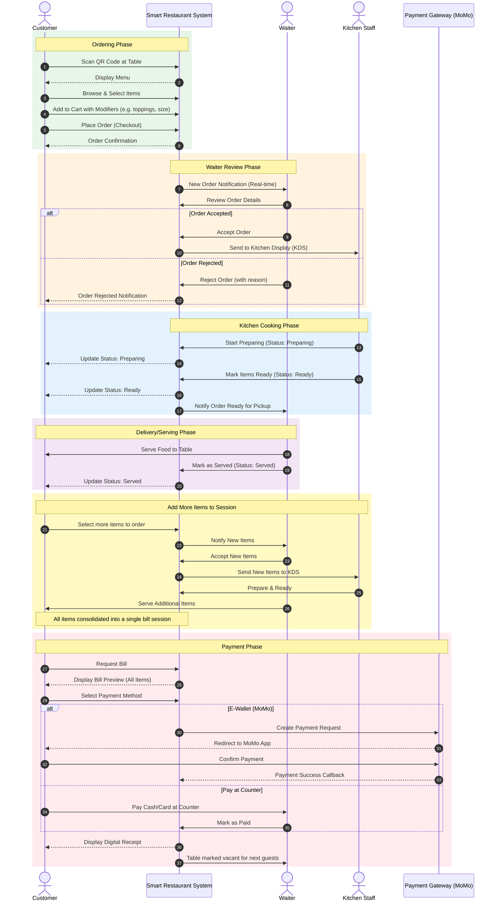
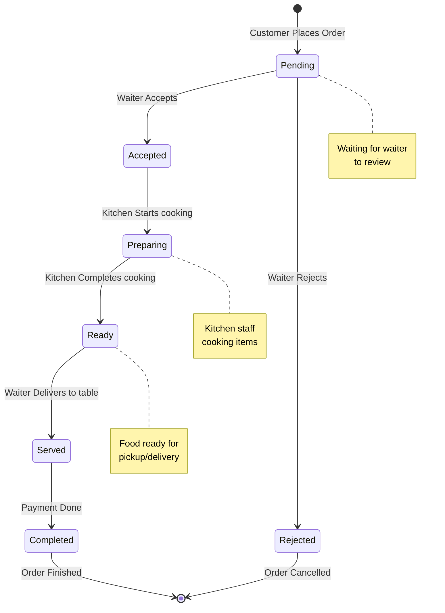

# Smart Restaurant

A QR-based menu ordering system for dine-in service, optimizing order flows, kitchen operations, and payment workflows.

**Live Environments:**
- **Frontend (FE):** https://worldwide-restaurant.onrender.com
- **Backend (BE):** https://worldwide-restaurant-spring.onrender.com

It can take you from **7 to 10 minutes** in order to **wake up the render server**. Because I use the free version, the server will be off if there is no request sent to the server for a long time.

The **admin account** you can take [here](#usage).

## Table of Contents

- [Introduction](#introduction)
- [Features](#features)
- [Installation](#installation)
- [Usage](#usage)
- [Tech Stack](#tech-stack)
- [API Documentation](#api-documentation)
- [Author](#author)
- [Advisor](#advisor)

---

## Introduction

**Smart Restaurant** is a QR-based menu ordering system designed for **dine-in services**. It digitalizes the entire dining experience, from table scanning and order placement to kitchen preparation and payment processing.

### Problem Statement
Many small and medium restaurants lack a simple, affordable way to offer mobile ordering from tables. Customers often wait a long time for staff to take orders or bring the bill, leading to slower service and lost revenue opportunities.

### Proposed Solution
Provide a lightweight platform where restaurants can generate unique QR codes for each table. Customers scan the QR code to open the restaurant's digital menu on their phone, customize items (with modifiers), and submit orders directly. Orders are routed immediately to staff via a Kitchen Display System (KDS) and a Waiter dashboard, supporting table-billing and payment gateway integration.

**Smart Restaurant** system enables restaurants to:
- Manage digital menus with categories, items, and modifiers
- Generate unique QR codes for each table
- Allow customers to scan QR, browse menu, and place orders from their phones
- Customers can add items to their current order during their visit (single order per table session)
- Process payments after the meal via payment gateway integration (ZaloPay, MoMo, VNPay, Stripe, etc.) - pay-after-meal model
- Track orders in real-time via Kitchen Display System (KDS)
- View analytics and performance reports (future feature)

### Main Flow Diagram


```mermaid
sequenceDiagram
    autonumber
    actor Customer
    participant System as Smart Restaurant System
    actor Waiter
    actor Kitchen as Kitchen Staff
    participant Payment as Payment Gateway (MoMo)

    %% Ordering Phase
    rect rgb(232, 245, 233)
        Note over Customer,System: Ordering Phase
        Customer->>System: Scan QR Code at Table
        System-->>Customer: Display Menu
        Customer->>System: Browse & Select Items
        Customer->>System: Add to Cart with Modifiers (e.g. toppings, size)
        Customer->>System: Place Order (Checkout)
        System-->>Customer: Order Confirmation
    end

    %% Waiter Acceptance Phase
    rect rgb(255, 243, 224)
        Note over System,Waiter: Waiter Review Phase
        System->>Waiter: New Order Notification (Real-time)
        Waiter->>System: Review Order Details
        alt Order Accepted
            Waiter->>System: Accept Order
            System->>Kitchen: Send to Kitchen Display (KDS)
        else Order Rejected
            Waiter->>System: Reject Order (with reason)
            System-->>Customer: Order Rejected Notification
        end
    end

    %% Kitchen Preparation Phase
    rect rgb(227, 242, 253)
        Note over Kitchen,System: Kitchen Cooking Phase
        Kitchen->>System: Start Preparing (Status: Preparing)
        System-->>Customer: Update Status: Preparing
        Kitchen->>System: Mark Items Ready (Status: Ready)
        System-->>Customer: Update Status: Ready
        System->>Waiter: Notify Order Ready for Pickup
    end

    %% Serving Phase
    rect rgb(243, 229, 245)
        Note over Waiter,Customer: Delivery/Serving Phase
        Waiter->>Customer: Serve Food to Table
        Waiter->>System: Mark as Served (Status: Served)
        System-->>Customer: Update Status: Served
    end

    %% Add More Items
    rect rgb(255, 249, 196)
        Note over Customer,Kitchen: Add More Items to Session
        Customer->>System: Select more items to order
        System->>Waiter: Notify New Items
        Waiter->>System: Accept New Items
        System->>Kitchen: Send New Items to KDS
        Kitchen->>System: Prepare & Ready
        Waiter->>Customer: Serve Additional Items
        Note over Customer,System: All items consolidated into a single bill session
    end

    %% Payment Phase
    rect rgb(255, 235, 238)
        Note over Customer,Payment: Payment Phase
        Customer->>System: Request Bill
        System-->>Customer: Display Bill Preview (All Items)
        Customer->>System: Select Payment Method
        alt E-Wallet (MoMo)
            System->>Payment: Create Payment Request
            Payment-->>Customer: Redirect to MoMo App
            Customer->>Payment: Confirm Payment
            Payment-->>System: Payment Success Callback
        else Pay at Counter
            Customer->>Waiter: Pay Cash/Card at Counter
            Waiter->>System: Mark as Paid
        end
        System-->>Customer: Display Digital Receipt
        System->>Waiter: Table marked vacant for next guests
    end
```

### Order State Diagram


```mermaid
stateDiagram-v2
    [*] --> Pending: Customer Places Order

    Pending --> Accepted: Waiter Accepts
    Pending --> Rejected: Waiter Rejects

    Rejected --> [*]: Order Cancelled

    Accepted --> Preparing: Kitchen Starts cooking
    Preparing --> Ready: Kitchen Completes cooking
    Ready --> Served: Waiter Delivers to table
    Served --> Completed: Payment Done

    Completed --> [*]: Order Finished

    note right of Pending
        Waiting for waiter
        to review
    end note

    note right of Preparing
        Kitchen staff
        cooking items
    end note

    note right of Ready
        Food ready for
        pickup/delivery
    end note
```

---

## Features

- **Digital Menu Management:** Create categories, menu items, and optional modifier groups (e.g., size, toppings, specific request checkboxes).
- **QR Code Generation:** Generate and download a unique QR code for each dining table.
- **Contactless Ordering:** Customers scan QR codes, browse menus, customize dishes, and place orders directly from their phones.
- **Consolidated Session Billing:** Allow customers to add extra items multiple times during their stay and combine them into a single bill.
- **Kitchen Display System (KDS):** A real-time display queue for kitchen staff to track and prepare orders.
- **Waiter Order Management:** Real-time order approvals, status tracking, and request-bill handling for table service staff.
- **Payment Gateway Integration:** Secure payment checkout via e-wallet (MoMo) or cash/card settlement at the counter.
- **Business Analytics:** Access sales charts, revenue metrics, and top-selling food reports for administrators.


## Installation

### 1. Clone Project
```bash
git clone https://github.com/huuthang-0355/worldwide-restaurant.git
cd worldwide-restaurant
```

### 2. Configure and Run Backend
Navigate to the backend directory:
```bash
cd RestaurantBackend
```
Update your local database credentials and MoMo credentials in `src/main/resources/application.properties`:
```properties
spring.datasource.url=jdbc:postgresql://localhost:5432/db_name
spring.datasource.username=your_username
spring.datasource.password=your_password
```
Build the project using Maven:
```bash
./mvnw.cmd clean install -DskipTests
```
Start the Spring Boot backend:
```bash
./mvnw.cmd spring-boot:run
```
The backend will run at `http://localhost:8080`.

### 3. Configure and Run Frontend
Navigate to the frontend directory:
```bash
cd ../frontend
```
Install the package dependencies:
```bash
npm install
```
Start the Vite development server:
```bash
npm run dev
```
The frontend will run at `http://localhost:5173`.

---

## Usage

### Default Admin Account
- **Email:** `admin@restaurant.com`
- **Password:** `Admin@123`

### User Roles

| Role | Description |
| :--- | :--- |
| **Guest** | Scanning customer who browses the menu, builds carts, and places table orders. |
| **Customer** | Registered diner who can save favorites and view order history. |
| **Admin** | Restaurant owner with full configurations (staff, menus, tables, sales reports). |
| **Waiter** | Service staff who reviews pending orders, sends orders to kitchen, serves items, and clears tables. |
| **Kitchen Staff** | Chefs who manage the KDS queue, start cooking, and mark orders as ready. |

---

## Tech Stack

### Core Technologies

| Layer | Technologies / Frameworks |
| :--- | :--- |
| **Backend** | Java 21, Spring Boot 4.0.2, Spring Security, JPA Hibernate |
| **Database** | PostgreSQL |
| **Frontend** | React 19, Vite 7, TailwindCSS 4, Axios, Lucide Icons |
| **Real-Time** | Server-Sent Events (SSE) via Spring `SseEmitter` & HTML5 `EventSource` |

### Primary Dependencies

| Dependency | Purpose / Usage |
| :--- | :--- |
| **ZXing** | Table QR Code generation |
| **Apache PDFBox** | Table invoice PDF exports |
| **Cloudinary** | Menu photo uploads and cloud hosting |
| **Spring Boot Mail** | Email notifications and verification token dispatching |
| **jjwt (0.12.6)** | JSON Web Token user authentication and session management |

---

## API Documentation

The backend includes Swagger UI to search and test API endpoints:
- **Interactive UI Docs:** https://worldwide-restaurant-spring.onrender.com/swagger-ui/index.html
- **OpenAPI Specs (JSON):** https://worldwide-restaurant-spring.onrender.com/v3/api-docs

---

## Author

Võ Hữu Thắng - [GitHub](https://github.com/huuthang-0355)

---

## Advisor

Ths. Nguyễn Huy Khánh
