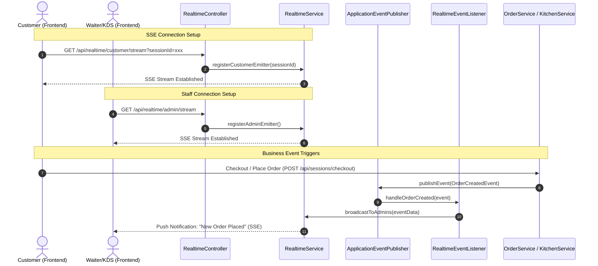

# Real-Time Feature Implementation Plan

This document outlines the design and step-by-step plan for implementing real-time features across the **Smart Restaurant App** (KDS updates, Waiter Dashboard alerts, and Customer Order tracking).

It strictly adheres to:
1. [rules-for-backend-code.md](file:///c:/VoHuuThang/coding/personal-projects/java-projects/smart-restaurant-app/Source/docs/rules-for-backend-code.md)
2. [rules-for-frontend-code.md](file:///c:/VoHuuThang/coding/personal-projects/java-projects/smart-restaurant-app/Source/docs/rules-for-frontend-code.md)

---

## Technical Overview: Server-Sent Events (SSE)

To respect the **"NO NEW DEPENDENCIES"** rule for both backend (Maven) and frontend (npm), we will use **Server-Sent Events (SSE)**.
- **Backend:** Spring Boot's built-in `SseEmitter` (`org.springframework.web.servlet.mvc.method.annotation.SseEmitter`).
- **Frontend:** HTML5's native `EventSource` API supported by all modern browsers.

### Architecture Flow



---

## 1. Backend Changes (Spring Boot)

We will follow the **Controller -> Service -> Repository** layered architecture pattern. No database repository changes are needed since connections are stored in-memory using thread-safe maps.

### Step 1.1: Custom Application Events
Define Spring Application Events to decouple business operations from the notification pushing layer:
- `OrderStatusChangedEvent`: Triggered when an order transitions (e.g., `PENDING` -> `ACCEPTED` -> `PREPARING` -> `READY` -> `SERVED`).
- `OrderCreatedEvent`: Triggered when a customer checks out and places a new order.

### Step 1.2: Real-Time Service (`RealtimeService.java`)
Manage the registry of active `SseEmitter` clients in a thread-safe manner.
- **Data Structures**:
  - `ConcurrentHashMap<UUID, List<SseEmitter>> customerEmitters`: Key is the `sessionId` (representing the table/customer group).
  - `CopyOnWriteArrayList<SseEmitter> adminEmitters`: Shared registry for KDS and Waiter Dashboard clients.
- **Key Methods**:
  - `addCustomerEmitter(UUID sessionId)`: Returns an `SseEmitter` with a reasonable timeout (e.g., 3 minutes) and registers cleanup callbacks (`onTimeout`, `onCompletion`, `onError`).
  - `addAdminEmitter()`: Registers and returns an admin/staff `SseEmitter`.
  - `broadcastToSession(UUID sessionId, Object data)`: Sends event payload to all clients in a specific session.
  - `broadcastToAdmins(Object data)`: Sends event payload to all waiter and KDS clients.

### Step 1.3: Real-Time Event Listener (`RealtimeEventListener.java`)
Use Spring's `@EventListener` to intercept business events:
- Listen to `OrderCreatedEvent` -> send structured updates to `adminEmitters` (so Waiter Dashboard updates in real time).
- Listen to `OrderStatusChangedEvent` -> send updates to both `adminEmitters` (updates KDS & Waiter dashboard) and `customerEmitters` (updates Customer App).

### Step 1.4: Real-Time Controller (`RealtimeController.java`)
Expose SSE streaming endpoints. Ensure proper authorization matches the specification.
- **Endpoints**:
  - `GET /api/realtime/customer/stream`: Standard endpoint for customers. Query param: `sessionId`. No special auth check required (guests can view).
  - `GET /api/realtime/admin/stream`: Requires `ADMIN` or `KITCHEN_STAFF` or `WAITER` role permissions. Apply `@PreAuthorize`.

### Step 1.5: Triggering Events in Existing Services
Inject `ApplicationEventPublisher` and publish events at the boundaries of transactional business methods:
- **In [OrderService.java](file:///c:/VoHuuThang/coding/personal-projects/java-projects/smart-restaurant-app/Source/RestaurantBackend/src/main/java/com/example/RestaurantBackend/service/OrderService.java#L159-L164)**: Publish `OrderCreatedEvent` at the end of the `checkout` method.
- **In [OrderService.java](file:///c:/VoHuuThang/coding/personal-projects/java-projects/smart-restaurant-app/Source/RestaurantBackend/src/main/java/com/example/RestaurantBackend/service/OrderService.java#L198-L206)**: Publish `OrderStatusChangedEvent` in the `updateOrderStatus` method.
- **In [KitchenService.java](file:///c:/VoHuuThang/coding/personal-projects/java-projects/smart-restaurant-app/Source/RestaurantBackend/src/main/java/com/example/RestaurantBackend/service/KitchenService.java#L98-L102)**: Publish `OrderStatusChangedEvent` on preparing/ready KDS changes.

---

## 2. Frontend Changes (ReactJS + Tailwind CSS)

We will structure the frontend functionality by separating API concerns, utilizing hooks for connection state, and integrating them cleanly into page views.

### Step 2.1: Custom React Hook (`useRealtime.js`)
Create a reusable custom hook `src/hooks/useRealtime.js` using vanilla JavaScript and `EventSource` to manage:
- Connecting to the specified endpoint with appropriate credentials.
- Listening for specific events (`new-order`, `status-update`).
- Handling reconnection logic on connection drop.
- Cleaning up (`eventSource.close()`) when the component unmounts.

```javascript
// Draft hook interface
export function useRealtime(endpointUrl, onEventReceived) {
    useEffect(() => {
        const eventSource = new EventSource(endpointUrl, {
            withCredentials: true, // Crucial for passing JWT auth cookies if needed
        });
        
        eventSource.onmessage = (event) => {
            const data = JSON.parse(event.data);
            onEventReceived(data);
        };

        eventSource.onerror = (error) => {
            console.error("SSE connection error, auto-reconnecting...", error);
        };

        return () => eventSource.close();
    }, [endpointUrl]);
}
```

### Step 2.2: Waiter Dashboard Integration (`AdminOrders.jsx`)
- Integrate `useRealtime` connecting to `/api/realtime/admin/stream`.
- When a `new-order` event is received, append it to the local order list state and play a subtle chime/alert sound.
- When an `order-updated` event is received, find and update that specific order's status in the state.

### Step 2.3: Kitchen Display System Integration (`KitchenDisplay.jsx`)
- Connect to the `/api/realtime/admin/stream`.
- Listen for status changes (e.g., when a waiter clicks "Send to Kitchen", the order transitions to `IN_KITCHEN`). Add the new card to the screen in real-time.
- Remove orders from the KDS grid instantly when they are marked as `READY` by the chef.

### Step 2.4: Customer Order Tracker (`CustomerOrders.jsx` & `BillPreview.jsx`)
- Retrieve the current `sessionId` from local storage.
- Connect to `/api/realtime/customer/stream?sessionId={sessionId}`.
- Update the UI status badges in real-time when the status transitions (e.g. flashing green when food is "READY" to pick up/be served).

---

## 3. Verification Plan

### Automated Tests (Backend)
- Add mock MVC tests in a new test class `RealtimeControllerTest.java` to:
  - Verify that the SSE streams open correctly.
  - Verify that CORS headers and connection headers are correctly set (`Content-Type: text/event-stream`).

### Manual Verification
1. Open two browser windows:
   - **Window A (Customer)**: Place an order from the client menu.
   - **Window B (Waiter/Admin Dashboard)**: Look at the order list.
2. Verify that Window B immediately displays the new order without a manual refresh.
3. Accept the order in Window B and send it to the kitchen. Verify that the KDS page immediately populates the order card.
4. Mark the order as `PREPARING` in the KDS. Verify that the customer tracker in Window A updates the badge to "Preparing" in real-time.
